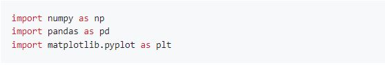
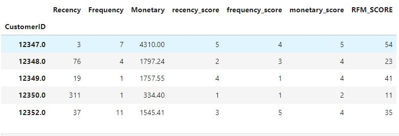
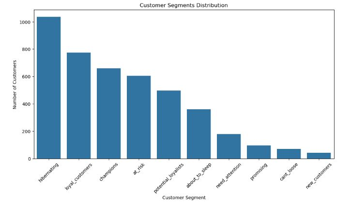

# Marketing Data Science Project - Customer Segmentation Using RFM Analysis

## Project Overview

This project is focused on **Customer Segmentation** using the **RFM (Recency, Frequency, Monetary)** analysis method. The goal of the analysis is to segment customers based on their purchasing behavior, which helps in understanding the value each customer brings to the business and in targeting different customer segments for marketing strategies.

## Data Source

The dataset used for this project is the [Online Retail dataset](https://archive.ics.uci.edu/dataset/352/online+retail) from the UCI Machine Learning Repository. It contains transactions occurring between 01/12/2010 and 09/12/2011 for a UK-based and registered non-store online retail company.

## Libraries Used

## Steps of Analysis

### 1. Data Import and Inspection
- The dataset was loaded, and an initial inspection was performed to understand its structure and content.
- We examined columns such as `InvoiceNo`, `StockCode`, `Description`, `Quantity`, `InvoiceDate`, `UnitPrice`, `CustomerID`, and `Country`.
- Missing values were detected in the `CustomerID` and `Description` columns.

### 2. Data Cleaning
- We removed missing values from the dataset, focusing particularly on entries without a `CustomerID`, as this field is crucial for customer segmentation.
- Entries with negative values in `Quantity` and `UnitPrice` were excluded from the analysis to ensure data accuracy.

### 3. Feature Engineering
- A new column, `TotalPrice`, was created by multiplying `Quantity` by `UnitPrice` to represent the total revenue generated by each transaction.
- The dataset was grouped by `CustomerID` to calculate RFM values for each customer:
  - **Recency**: The number of days since the customer’s last purchase.
  - **Frequency**: The number of unique transactions made by the customer.
  - **Monetary**: The total amount spent by the customer.

### 4. RFM Scoring
- RFM scores were created by dividing the **Recency**, **Frequency**, and **Monetary** values into quintiles (1 to 5), helping to categorize customers based on their purchasing behavior.
- The **RFM Score** was calculated as a combination of Recency and Frequency scores: `RFM_SCORE = recency_score + frequency_score`.

### 5. Customer Segmentation
- Customers were segmented into different categories based on their RFM scores. For example:
  - Customers with high recency and frequency scores were identified as **Loyal Customers**.
  - Customers with low recency but high monetary values were categorized as **At Risk** or **Hibernating**.

---

## Results

---

## Key Insights from the RFM Analysis

#### 1. Top Customers by Monetary Value:
- Customers with the highest monetary scores were identified. These are typically the most valuable customers, driving the highest revenue.

#### 2. Customer Segments:
- **Loyal Customers (RFM score: 54, 55):** Customers who make frequent purchases and have a recent transaction history.
- **New Customers (RFM score: 51, 52):** Customers who are relatively new and have high recency scores.
- **At-Risk Customers (RFM score: 11, 12):** Customers who haven’t made a purchase recently and may need re-engagement.
- **Potential Loyalists (RFM score: 43, 44):** Customers with frequent purchases and average recency scores who could become loyal customers.

#### 3. Revenue Concentration:
- A significant portion of revenue was generated by a small subset of loyal and high-spending customers. This suggests that focusing marketing efforts on these segments can improve ROI.

---

## Visualization

- This bar chart illustrates the distribution of customer segments based on RFM analysis. The most prevalent segment is "Hibernating," followed by "Loyal Customers" and "Champions." The chart shows a decreasing number of customers in other segments, such as "At Risk," "Potential Loyalists," and "About to Sleep," providing insight into where the business might focus its marketing or re-engagement efforts.

